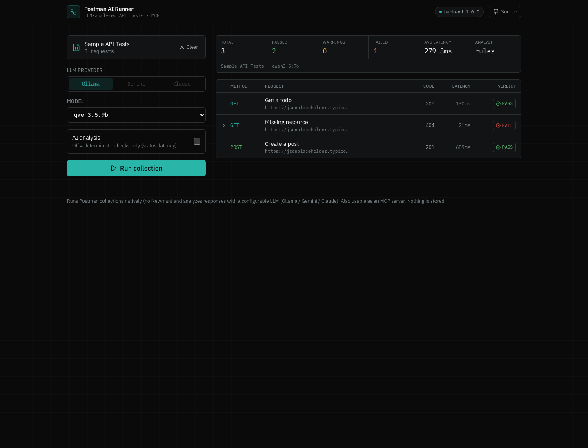

# MCP Postman AI Runner

**Run Postman collections and let an LLM grade every response** — as a web
dashboard *and* as an MCP server. A configurable analyst (local **Ollama** by
default, or **Gemini** / **Claude**) reads each request/response and returns a
PASS / WARN / FAIL verdict with anomalies and a one-line summary, layered on top
of deterministic checks (status codes, latency, transport errors).

This is a ground-up rebuild of an earlier prototype: it drops the Node/Newman
dependency for a native Python runner, makes the LLM backend pluggable, and adds
a dashboard UI.



## Why it's different from the original

- **No Newman / Node.** A native Python runner parses Postman v2.1 collections,
  resolves `{{variables}}`, executes requests with `httpx`, and captures each
  transaction. Runs identically locally, in the MCP server, and in a container.
- **Pluggable LLM.** `ollama` (default, no key), `gemini`, or `claude` — all via
  REST, no heavy SDKs. Pick provider + model per run.
- **Two layers of judgement.** Deterministic checks always run (so the report is
  useful even with no LLM); the LLM adds nuance. The worst signal wins.
- **Web dashboard + MCP server** from one shared core.
- **Stateless.** Nothing is written to disk or a database.

## Run it

### Backend (Python 3.10+)

```bash
cd backend
python3 -m venv .venv && source .venv/bin/activate
pip install -r requirements.txt
cd .. && uvicorn backend.main:app --reload --port 8000
```

Default analyst is local Ollama (`ollama serve`, any model). Override with env:

| Env | Meaning |
|-----|---------|
| `MCP_PROVIDER` | default provider (`ollama` / `gemini` / `claude`) |
| `OLLAMA_MODEL` | default Ollama model (else first installed) |
| `GEMINI_API_KEY` / `ANTHROPIC_API_KEY` | enable those providers |
| `MCP_ALLOWED_ORIGINS` | extra CORS origins (the hosted frontend) |

### Frontend

```bash
cd frontend && npm install && npm run dev      # http://localhost:5173
```

### As an MCP server

Point an MCP client (e.g. Claude Desktop) at `mcp_server/server.py` using the
project's venv. Tools: `run_postman_collection(collection_path, provider, model)`
and `list_llm_providers()`.

```json
{
  "mcpServers": {
    "postman-ai-runner": {
      "command": "/ABS/PATH/backend/.venv/bin/python",
      "args": ["-m", "mcp_server.server"],
      "cwd": "/ABS/PATH/mcp-postman-ai-runner"
    }
  }
}
```

### Tests

```bash
source backend/.venv/bin/activate && python -m pytest backend/tests -q
```

## API

| Method | Path | Purpose |
|---|---|---|
| `GET`  | `/api/info` | providers, installed Ollama models, defaults |
| `POST` | `/api/run`  | run a collection → AI QA report |

## Hosting

Frontend → GitHub Pages, backend → a Hugging Face Docker Space. See
[`DEPLOY.md`](DEPLOY.md). Note: the hosted backend has no Ollama, so on the live
demo use deterministic mode or set a `GEMINI_API_KEY` / `ANTHROPIC_API_KEY`
Space secret; full local runs use Ollama.
